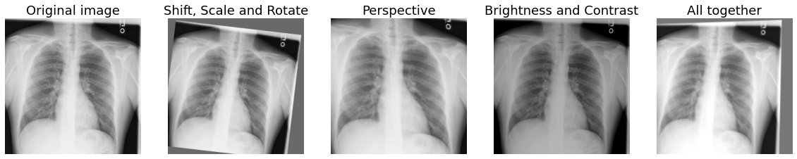
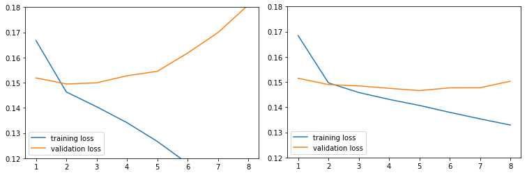

# Augmented Chest X-Ray

## Introduction
**Augmented Chest X-Ray** is a tool that uses data augmentation for training
CNN models specialized in multi-label classification of thorax anomalies in
X-ray images.
* Optimized for training on the *NIH Chest X-ray Dataset*, introduced by Wang 
et al.<sup id="ref1">[1](#foot1)</sup>
* Uses a 121-layer Dense Convolutional Neural Network (DenseNet), pretrained on
ImageNet, with an added sigmoid nonlinearity, as discussed by Rajpurkar et al.
in *CheXNet*.<sup id="ref2">[2](#foot2)</sup>
* Produces a trained model along with classification thresholds for each of 14
pathologies.
* Implemented in PyTorch.
* Enhanced with data augmentation from
[Albumentations](https://albumentations.ai/).

## Table of Contents
1. [Using the Repository](#instructions)
    * [Setup and Requirements](#requirements)
    * [The Dataset](#dataset)
    * [Preprocessing](#preprocessing)
    * [Training](#training)
    * [Validation on the Test Set](#testing)
2. [Comparison of Minimal vs. Advanced Data Augmentation](#augmentation)
    * [Comparison Setup](#setup)
    * [Implementation](#implementation)
    * [Results](#results)
    * [Parameters for Reproducing the Comparison](#reproduce)
3. [Reference](#reference) 

## Using the Repository <a name="instructions"></a>

### Setup and Requirements <a name="requirements"></a>

#### Required Libraries
* Python 3.8
* Pytorch 1.11 with CUDA 11.3
* [Albumentations](https://albumentations.ai/)
* [WebDataset](https://github.com/webdataset/webdataset)
* scikit-learn
* pandas

#### Installation using Anaconda
Clone the project from GitHub:
```shell
$ git clone https://github.com/MichaelNoya/augmented-chest-xray.git
```
Change into the cloned directory and create the Anaconda environment:
```shell
$ cd augmented-chest-xray
$ conda env create -f environment.yml
```
Activate the environment:
```shell
$ conda activate augmented_chest_xray
```

### The Dataset <a name="dataset"></a>
To train the classifier you require the *NIH Chest X-ray Dataset*. You can
either download the full dataset (45GB), or a sample subset (1GB). The sample
subset is already preprocessed and ready-to-use.

#### Download the Full Dataset
The full *NIH Chest X-ray Dataset* contains 112,120 X-ray images from 30,805
unique patients. It can be downloaded from the <b>National Institutes of
Health - Clinical Center</b> at this 
[link](https://nihcc.app.box.com/v/ChestXray-NIHCC). The required files are: 
- The extracted images
- `Data_Entry_2017_v2020.csv`, which contains the class labels and patient
data.

Save the extracted images in
`./augmented_chest_xray/data/original_data/images/` and the data entry file in
`./augmented_chest_xray/data/original_data/meta_data/` and proceed to
[Preprocessing](#preprocessing).

#### Download the Sample Subset
The sample subset consists of 18,031 X-ray images of 5,000 unique patients. It
can be found in the
[nih-chest-xray-webdataset-subset](https://github.com/MichaelNoya/nih-chest-xray-webdataset-subset)
repository. Copy all the files from the `./datasets/` and `./labels/`
directories into the `./augmented_chest_xray/data/datasets/` and
`./augmented_chest_xray/data/labels/` directories. Since this subset is already
preprocessed, you can skip the preprocessing step and go directly to
[Training](#training).

### Preprocessing <a name="preprocessing"></a>
Use `preprocess_data.py` to perform the following steps:
* Split the data into training, validation and test sets with no patient
overlap between the sets.
* Downscale the images and pack them into WebDataset tar archives for
sequential data access.

Run the preprocessing with default parameters:
```shell
$ python preprocess_data.py
```

#### Optional Parameters
* `-r` or `--random_seed`: Seed for the random split of the dataset.
* `-s` or `--subset_size`: If a subset_size is specified, the training,
validation and test sets will be created using images of only a subset of the
patients from the original dataset.

#### Default Values
The following values can be adjusted in `config.py`:
```
# Size in pixel for downscaling the images
DATASET_IMAGE_SIZE = 256

# Size ratio of the datasets
TRAIN_VAL_TEST_RATIO = (0.7, 0.1, 0.2)

# Input filenames and directories
IMAGE_DIR = './data/original_data/images/'
META_DATA_DIR = './data/original_data/meta_data/'
META_FILENAME = 'Data_Entry_2017_v2020.csv'

# Output filenames and directories
LABELS_DIR = './data/labels/'
DATASET_DIR = './data/datasets/'
TRAIN_LABELS = 'train_labels.csv'
VAL_LABELS = 'val_labels.csv'
TEST_LABELS = 'test_labels.csv'
```

### Training <a name="training"></a>
Use `train_model.py` to train a CNN image classifier. After each epoch of 
training the model is validated on the validation dataset. If the validation 
loss is lower than the loss in previous epochs, the state_dict containing the
weights of the model is stored in a dictionary along with the corresponding
thresholds for each class. This dictionary is saved as
`<year_date_time>_model.pt` and overwritten, whenever a lower validation loss
is measured during the same training session. Additionally, training results
are logged and saved as `<year_date_time>_results.pt` after each epoch. The
results include the mean AUROC and mean F1 score as well as the training and
validation loss for each epoch.

To train a new model using default parameters type:
```shell
$ python train_model.py
```

#### Optional Parameters
* `-b` or `--batch_size`: Specify a mini batch size to use during training and 
validation.
* `-w` or `--workers`: Turn on multi-process data loading with the specified
number of loader worker processes.
* `-l` or `--learning_rate`: Set a learning rate for the optimizer
initialization.
* `-f` or `--s_factor`: Factor by which the scheduler should reduce the
learning rate.
* `-p` or `--s_patience`: Number of epochs with no improvement that the
scheduler should wait before decreasing the learning rate.
* `-a` or `--augmentation`: Activate data augmentation.
* `-d` or `--debug`: Reduce the size of the datasets for debugging.
* `-s` or `--saved_model`: File to load a state_dict from a previous training
session.

#### Examples
Train a model for twelve epochs using the default values described in the
CheXNet paper: 
```shell
$ python train_model.py -b 16 -e 12 -l 0.001 -f 0.1
```
This example loads a model saved in `my_model.pt` and fine-tunes it for seven
epochs using data augmentation:
```shell
$ python train_model.py -b 16 -e 7 -l 0.001 -s my_model.pt -a
```

### Validation on the Test Set <a name="testing"></a>
Use `validate_model.py` to validate a trained model on the test set. The output 
is a table containing the area under the ROC (AUROC) for each class as well as
the mean AUROC over all classes. 

Validate the latest saved model:
```shell
$ python validate_model.py
```
If the model was trained using data augmentation, the validation performance
can be improved by using the center crop flag:
```shell
$ python validate_model.py --center_crop
```

#### Optional Parameters
* `-s` or `--saved_model`: Name of file from which to load the state_dict of a 
trained model. If no filename is provided, the most recently created
`*_model.pt` file will be loaded.
* `-b` or `--batch_size`: Specify a mini batch size to use during validation.
* `-w` or `--workers`: Turn on multi-process data loading with the specified
number of loader worker processes.
* `-c` or `--center_crop`: Center crop the images of the test set. Use this
flag if the dataset was enhanced with data augmentation during training.
* `-d` or `--debug`: Reduce the size of the dataset for debugging.
* `-f` or `--display_f1`: Display the F1 Scores for each class and the mean F1 
Score in the results table.

## Comparison of Minimal vs. Advanced Data Augmentation <a name="augmentation"></a>

### Comparison Setup <a name="setup"></a>
We compared the validation loss and test results of a group of models trained
using only minimal data augmentation to a group of models trained using a 
combination of various forms of data augmentation. While one group used only
horizontal flipping, the other group additionally used a combination of random
shifts, rotations and image cropping, as well as random changes in scaling,
perspective, brightness and contrast.



Out of each group five models were trained for eight epochs each. For easier
comparison, the learning rate during training was was fixed at 0.0001 for all
training runs, with no learning rate decay. The models with the lowest
validation loss in their respective group were selected for validation on a
separate test set. The error metric used for the final evaluation was the mean
area under the ROC (AUROC) over all classes.

### Implementation <a name="implementation"></a>
The data augmentation pipelines for the training dataset are implemented in the
module `transforms/augmented_transforms.py` using image transforms imported 
from [Albumentations](https://albumentations.ai/). Default data augmentation
parameters can be adjusted inside the module under the docstring block titled
`Data augmentation parameters`.

### Results <a name="results"></a>
When comparing the training and validation loss measured after each epoch we 
can observe a clear regularizing effect caused by the data augmentation. This
also affects the number of epochs the model needs to be trained for the
validation loss to reach a minimum. The group with the minimal data
augmentation reached its lowest validation loss after two to three epochs while
the group with advanced data augmentation reached its lowest validation loss
after five epochs on average.

<br>
*Training and validation loss using minimal data augmentation (left) and
advanced data augmentation (right).*

As expected, lower validation loss resulted to be a predictor for superior
performance on the test set. In the group with minimal data augmentation, the
lowest measured validation loss was 0.1495. The corresponding model had a mean
AUROC of 0.8153 on the test set. In the group trained using advanced data
augmentation the lowest validation loss was 0.1466 and the corresponding model
achieved a mean AUROC of 0.8308.

### Parameters for Reproducing the Comparison <a name="reproduce"></a>
Train the model with minimal data augmentation and validate it on the test set:
```shell
%run train_model.py -b 16 -e 8 -l 0.0001 -p 8
%run validate_model.py -b 32
```
Train the model with advanced data augmentation and validate it on the test set:
```shell
%run train_model.py -b 16 -e 8 -l 0.0001 -p 8 -a
%run validate_model.py -b 32 -c
```

## Reference <a name="reference"></a>

<b id="foot1">1.</b> [^](#ref1) Wang et al. [ChestX-ray8: Hospital-scale Chest X-ray Database and Benchmarks on Weakly-Supervised Classification and Localization of Common Thorax Diseases](https://arxiv.org/abs/1705.02315), 2017

<b id="foot2">2.</b> [^](#ref2) Rajpurkar et al. [CheXNet: Radiologist-Level Pneumonia Detection on Chest X-Rays with Deep Learning](https://arxiv.org/abs/1711.05225), 2017
